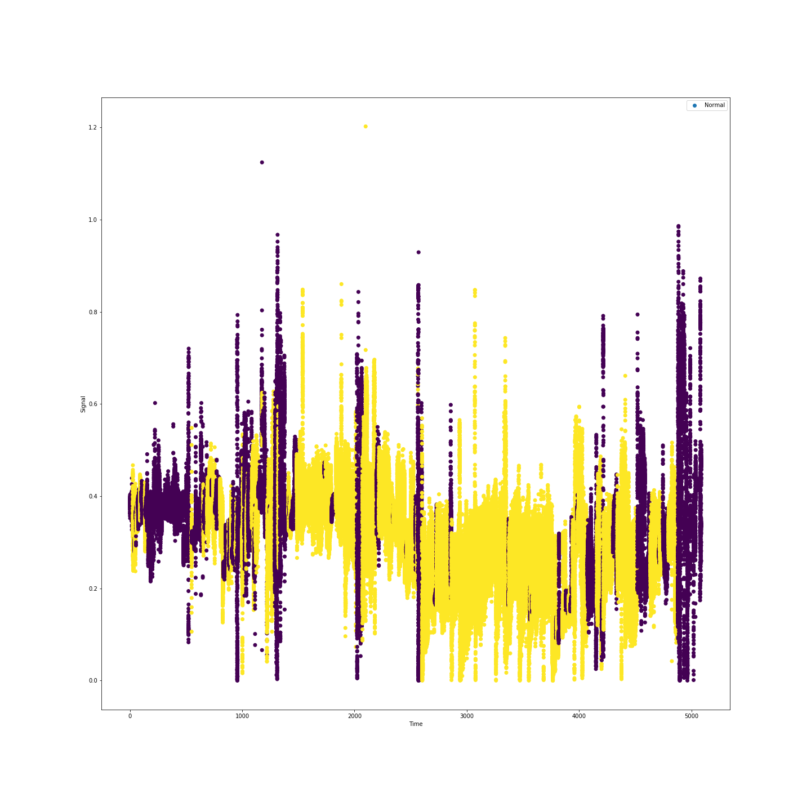
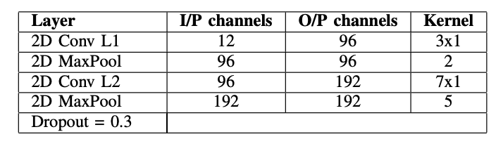
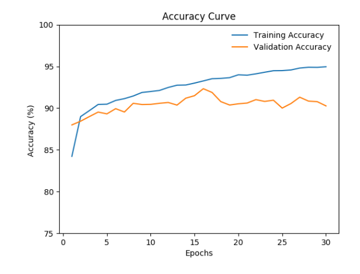
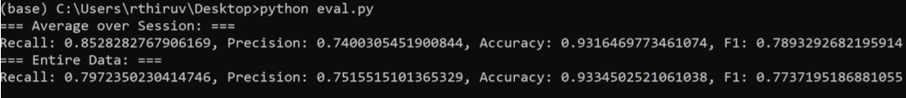
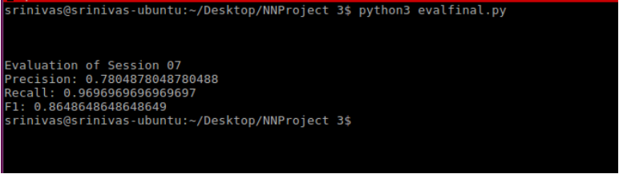

# Behavior Recognition using Time Series Classification

In this project, we develop Machine Learning models for Body-Rocking Behavior. We have obtained the data of wearable sensors on arm and wrist for 1-2 hours with which it's been determined whether there is Body Rocking behavior.

### Feature Extraction
The first step (pre- processing) in our approach is to extract the features from the IMU signals generated from accelerometer and gyroscopes from the 2 devices located on the arm and wrist of the subjects. For every session, the data is such that there are 3 readings of accelerometer and gyroscopes (corresponding to the 3 axes), each from both the devices installed on arm and wrist.
These readings are taken in the intervals of 2e−2 secs. So, essentially we group the 3 (x,y,z) readings of accelerometer/gyroscope for a window of rows in the Session and extract temporal and frequency based features. Some of the temporal features include mean, variances and covariances, skewness and Kurtosis. The frequency based features involve computing the maximum frequency response and we use FFT.
While extracting features we observe that we extract 21 features (scalar values) for every window corresponding to accelerometer/gyroscope. This way we extract 84 features for every window, when we combine the accelerometer and gyrosope IMU signals generated from the device on arm and wrist.

Input Data:

  

Models Trained:
- SVM 
- Conv1D
- Conv2D-LSTM

Model architecture for Conv2d-lstm:

  

## Results

  

  

  

